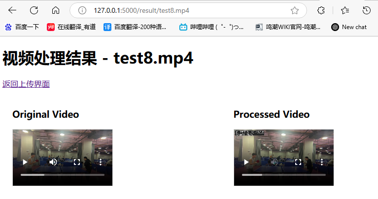
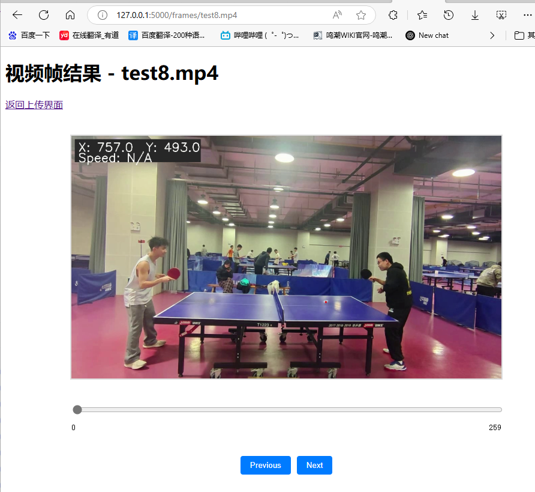
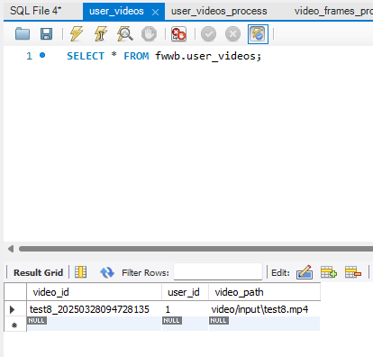
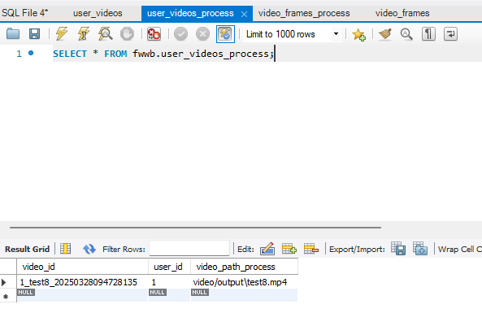
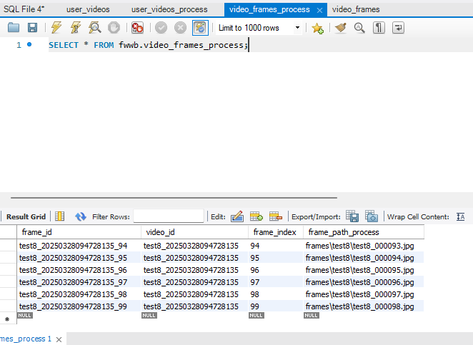

# ball_detect使用方法
### 首先，数据库需要按照fwwb.sql的格式创建，修改video_id和frame_id的类型为varchar(255)
###
### 选择文件上传，将本地内容上传到网站上，拷贝一份到项目路径ball_detect/video/input/*.mp4，

### 点击进行处理后，等待响应，响应后有如下界面
###

###
### 可以点击“查看视频结果”“查看帧结果”“删除记录”
###

###
### 数据库同步更新
###

